

# Loadtest Setup

 

 ## 1. Task requirement:

To show the result of response time in grafana with the help of locust tool.

## 2. Load testing:

Load Testing is a non-functional software testing process in which the performance of software application is tested under a specific expected load. It determines how the software application behaves while being accessed by multiple users simultaneously.

## 3. Environmental detail:

* **OS:** Ubuntu 20.04

* Podman 3.4.2

## 4. System configuration:

* CPU - 4 

* Storage -16 GB

## 5. List of tools and technologies:

* Grafana
* Postgres 
* Locust 
 

## Definition of tools:

* ### **Grafana:**

 Grafana is a multi-platform open source analytics and interactive visualisation web application. It provides charts, graphs, and alerts for the web when connected to supported data sources. It can be easily installed using Docker or Docker Compose.

* ### **PostgreSQL:**

 PostgreSQL, also known as Postgres, is a free and open-source relational database management system emphasising extensibility and SQL compliance.

* ### **Locust:** 

 Locust is an open-source load-testing tool. Load testing is a type of software testing that is conducted to check the tolerance/behaviour of the system under a specific expected load.

# Command for the setup or configuration

## Step 1: Load test without grafana and timescale-DB

In this step, you've been provided instructions on how to perform a Load Test without using Grafana and Timescale-DB. You'll be using the Locust tool for this purpose.

**1.1 Install Locust:** Locust is a Python-based load testing tool. You can install it using the following command.

~~~
pip3 install locust
~~~  

* **pip3:** This is a package installer for Python. It's commonly used to install packages and libraries from the Python Package Index (PyPI) repository.

* **install:** This is a command provided by pip3 to install packages or libraries.

* **locust:** This is the name of the package you want to install, in this case, the Locust load testing tool.

**1.2 Install Locust Plugins:**
Locust offers additional functionality through plugins. You can install these plugins with the following command.
~~~
pip3 install locust_plugins
~~~

* **pip3:** This is the command-line tool for installing Python packages from the Python Package Index (PyPI) repository.

* **Install:** This is the command used by pip3 to install packages.

* **locust_plugins:** This is the name of the package you're installing. It's the package that contains various plugins and extensions designed to enhance the functionality and features of the Locust load testing tool.

**1.3 Create a file and give it a name locustfile.py**

~~~
touch locustfile.py
~~~
* **Add the below script in locustfile.py file using**

  ~~~
  vim locustfile.py
  ~~~

* **Change the IP address , according to your System IP by using the given command**

~~~
ip a
~~~

~~~
from locust import HttpUser, constant, task, between, TaskSet,SequentialTaskSet,events
import locust_plugins

@events.test_start.add_listener 

def on_test_start(environment, **kwargs):
    print("A new test is starting")

@events.test_stop.add_listener
def on_test_stop(environment, **kwargs):
    print("A new test is ending")

class inactiveUsers(SequentialTaskSet):
    @task
    def helloworld(self):
        with self.client.get("/hello",catch_response=True, name="helloworld",json={
            },headers={"accept":"application/json","Content-Type":"application/json"})as response:
            if response.status_code!=200:
                response.failure("Failed to get item: StatusCode "+str(response.status_code))
            else:
                json_response_data=response.json()
   
class MyinactiveUsers(HttpUser):
    wait_time=between(1,2)
    tasks= [inactiveUsers]
    host = "http://192.168.29.161:8080"
~~~
**1.4(a) Run the file locustfile.py**
~~~
locust -f locustfile.py
~~~

**Output**

* **locust:** This is the command you use to run the Locust tool. It's like telling your computer to start the "Locust" program.

* **-f locustfile.py:** This part tells the "Locust" program which test plan file to use for the load test. Think of the test plan file as a set of instructions that tell the tool what actions to perform during the load test. The -f stands for "file," and locustfile.py is the name of your test plan file.

**1.4(a) Now go to browser and run localhost:8089**

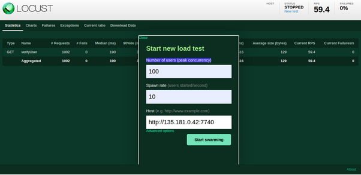

**1.5 Running a  container:**
~~~
podman run -itd --name loadtesting -p 8089:8089 -v <Directory Path>:/mnt/locust localhost/loadtest:v1 -f /mnt/locust/locustfile.py
~~~

* **podman run:** This command runs a container.

* **-itd:** These flags make the container run interactively, detached, and allocate a pseudo-TTY.

* **--name loadtesting:** Assigns the name "loadtesting" to the container.

* **-p 8089:8089:** Maps port 8089 from the container to port 8089 on the host.

* **-v <Directory Path>:/mnt/locust:** Mounts a directory on the host to a directory (/mnt/locust) inside the container.

* **localhost/loadtest:v1:** Specifies the container image (localhost/loadtest) and its version (v1).

* **-f /mnt/locust/locustfile.py:** Specifies the path to the test plan file inside the container.

* **localhost/loadtest:** v1 is an image with the in-built locust_plugins.please find the images below.

### **Note:** 
**- Now download the loadtest.tar file from the repo**
**- select the repo where file is downloaded**
~~~
cd Download
~~~
**Now select the path :**
~~~
pwd
~~~
cd /home/tajfatima/Downloads/

**Output**

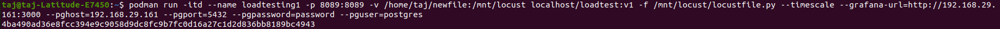

- Now untar the loadtest.tar file

~~~
tar -xvf loadtest.tar
~~~

**-Run the command:**
~~~
podman load -i loadtest.tar
~~~

## Step 2. Load test with Grafana and timescale db.

### Setting up grafana and postgres -DB

In this step, we're setting up a load test environment with Grafana (for visualization) and Timescale-DB (for data storage).

**2.1. Setting up grafana and postgres db.**

**Create a pod with name timescale and expose ports 5432 and 3000:** 

This command is used to create a "pod" in Podman, which is similar to a Docker container but with a slightly different approach. A pod is a group of one or more containers that share the same network namespace. This is often used when you have containers that need to communicate with each other as if they are on the same machine.

~~~
podman pod create --name timescale --publish 5432:5432 --publish 3000:3000
~~~

* **podman:** This is the command-line tool used for managing containers and pods in Podman, similar to how docker is used for Docker.

* **pod create:** This part of the command tells Podman that you want to create a new pod.

* **--name timescale:** This sets the name of the pod to "timescale". You can choose any name you prefer for your pod.

* **--publish 5432:5432 --publish 3000:3000:** This specifies that you want to expose ports from the pod to the host machine. The format is hostPort:containerPort. In this case, it's saying to map port 5432 from the host to port 5432 in the pod (for PostgreSQL) and to map port 3000 from the host to port 3000 in the pod (for Grafana). This allows you to access services running inside the pod from your host machine.

**Output:**

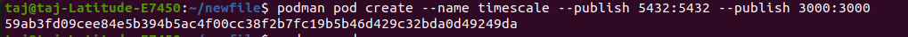

**Create a postgres container, give it the desired environment variables, attach it to the created pod**

Now create a directory with a name postgres 
~~~
mkdir -p postgres/data
~~~

Create a postgres container, give it the desired environment variables, attach it to the created pod : 

* Now Run the script given below
~~~
podman run -dt \
    --pod timescale \
    --name timescale-postgres \
    -e POSTGRES_PASSWORD=password \
    -e TIMESCALEDB_TELEMETRY=off \
    -v <directory Path>:/var/lib/postgresql/data \
    cyberw/locust-timescale:4
~~~

* **podman run -dt:** This starts a new container in detached mode (in the background).

* **--pod timescale:** This specifies that the container should be attached to the "timescale" pod, which was created earlier.

* **--name timescale-postgres:**
This sets the name of the container to "timescale-postgres". You can choose any name for your container.

* **-e POSTGRES_PASSWORD=password:** This sets the environment variable POSTGRES_PASSWORD to "password". This is the password you'll use to access the PostgreSQL instance inside the container.

* **-e TIMESCALEDB_TELEMETRY=off:** This sets the environment variable TIMESCALEDB_TELEMETRY to "off", which turns off telemetry data collection for TimescaleDB.

* **-v <directory Path>:/var/lib/postgresql/data:** This mounts a volume from the host machine to the container. The <directory Path> should be replaced with the actual path on my host machine. This is used to store the PostgreSQL data files persistently, so data isn't lost when the container is stopped.

* **cyberw/locust-timescale:4:** This specifies the name and version of the container image you're using for this PostgreSQL container. It will run the specified version of the "locust-timescale" image.

**Output:**

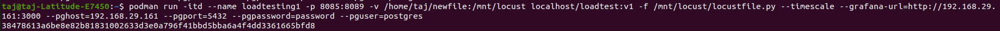

 * **Create the grafana container, give it the desired environment variables, importantly PGHOST, attach it to the created pod**

 This command creates a Grafana container, configures environment variables for it, and attaches it to the previously created "timescale" pod.

~~~
podman run -dt \
	--pod timescale \
	--name timescale-grafana \
	-e GF_AUTH_DISABLE_LOGIN_FORM=true \
	-e GF_AUTH_ANONYMOUS_ENABLED=true \
	-e GF_AUTH_ANONYMOUS_ORG_ROLE=Admin \
	-e GF_SECURITY_ALLOW_EMBEDDING=true \
	-e GF_LOG_LEVEL=warn \
	-e PGHOST=localhost \
	-v <Directory Path>:/var/lib/grafana \
        cyberw/locust-grafana:2
~~~
* **podman run -dt:** This starts a new container in detached mode (in the background).

* **--pod timescale:** This specifies that the container should be attached to the "timescale" pod, which was created earlier.

* **--name timescale-grafana:** This sets the name of the container to "timescale-grafana". You can choose any name for your container.

* **-e GF_AUTH_DISABLE_LOGIN_FORM=true:** This environment variable disables the Grafana login form, which means users won't need to log in to access Grafana.

* **-e GF_AUTH_ANONYMOUS_ENABLED=true:** This enables anonymous access to Grafana.

* **-e GF_AUTH_ANONYMOUS_ORG_ROLE=Admin:** This sets the role for anonymous users to "Admin" (they have administrative privileges).

* **-e GF_SECURITY_ALLOW_EMBEDDING=true:** This allows embedding Grafana dashboards in other web pages.

* **-e GF_LOG_LEVEL=warn:** This sets the logging level to "warn", which means Grafana will log warning messages.

* **-e PGHOST=localhost:** This specifies the PostgreSQL host for Grafana as "localhost". This is the same host as the PostgreSQL container running in the same pod.

* **-v <Directory Path>:/var/lib/grafana:** This mounts a volume from the host machine to the container. The <Directory Path> should be replaced with the actual path on your host machine. This is used to store Grafana data persistently.

* **cyberw/locust-grafana:2:** This specifies the name and version of the container image you're using for this Grafana container. It will run the specified version of the "locust-grafana" image.

**Output:**

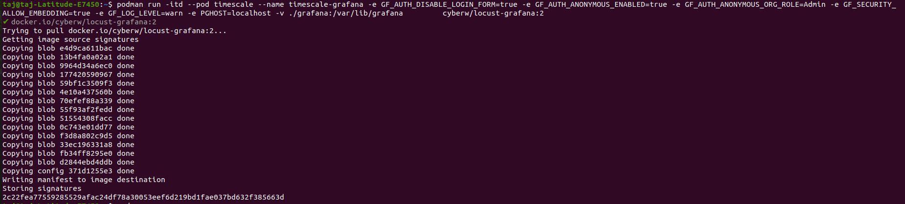

 **2.2 Create another temporary script to manage users data and run the same script.** 

* Create a directory with the name of Grafana

* Create a file with the name of pipeline.sh in the directory grafana

~~~
vim pipeline.sh
~~~

* Now add the script under that file

~~~
GRAFANA_CRED="admin:admin"
GRAFANA_HOST="http://localhost:3000"
GRAFANA_OVERWRITE=false
DS_NAME="locust_timescale"
PGHOST="postgres"
PGPORT="5432"

curl -u "$GRAFANA_CRED" $GRAFANA_HOST/api/datasources -XPOST -H "Accept: application/json" -H "Content-Type: application/json" -d '{"access": "proxy","basicAuth": false,"basicAuthPassword": "","basicAuthUser": "","database": "postgres","isDefault": false,"jsonData": {"postgresVersion": 1200,"sslmode": "disable", "timescaledb": true},"name": "'$DS_NAME'","orgId": 1,"password": "","readOnly": false,"secureJsonData": {"password": "password"},"type": "postgres","url": "'$PGHOST':'$PGPORT'","user": "postgres","version": 3,"withCredentials": false}'

ds=(10878 14423 14422 15419);
for d in "${ds[@]}"; do
  echo -n "Processing $d: "
  j=$(curl -s -k -u "$GRAFANA_CRED" $GRAFANA_HOST/api/gnet/dashboards/$d | jq .json)
  echo "{\"dashboard\":"${j}",\"overwrite\":$GRAFANA_OVERWRITE,\"inputs\":[{\"name\":\"DS_LOCUST\",\"type\":\"datasource\", \"pluginId\":\"postgres\",\"value\":\"$DS_NAME\"}]}" > payload.json
  curl -v -k -u "$GRAFANA_CRED" -H "Accept: application/json"\
    -H "Content-Type: application/json"\
    -d @payload.json \
    $GRAFANA_HOST/api/dashboards/import; echo ""
Done
~~~
* Now install JSON file 

~~~
sudo apt-get -y install jq
~~~

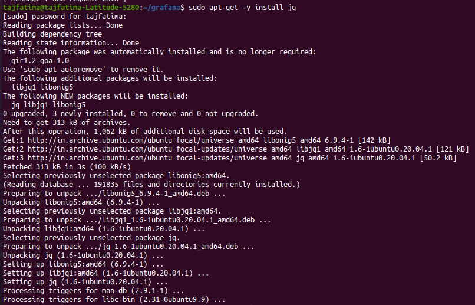

* **jq:** This is the name of the package you want to install. In this case, it's the jq tool, which is used for processing and manipulating JSON data in the command line.

* This command will download and install the jq package and its dependencies from the official Ubuntu repositories, making the jq tool available for use in your system.

 **2.3 Validate setup**

#### Validate postgres
~~~
podman exec -it timescale-postgres bash
bash-5.1# psql -U postgres
psql (13.7)
Type "help" for help.
~~~

* **exec:** This subcommand is used to execute a command within a running container. In this case, it's instructing podman to run a command inside the timescale-postgres container.
It is a common way to enter a PostgreSQL container and start an interactive PostgreSQL session for database management and querying.

**Output:**

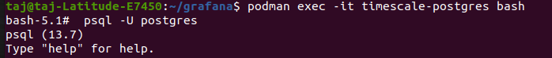

~~~
postgres=# \dt
~~~
**Output:**

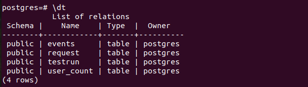

postgres=# select * from user_count ;

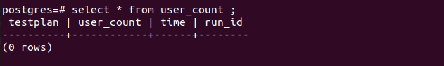

####  Validate grafana

Open browser http://localhost:3000 will show the home page of grafana, check the datasource and test the connection. 

**2.4  Setup locust** 

  Run the locust container with grafana and postgres configuration

~~~
podman run -itd --name loadtesting -p 8089:8089 -v <directory path to mount>:/mnt/locust localhost/loadtest:v1 -f /mnt/locust/locustfile.py --timescale --grafana-url=http://<machine ip>:3000 --pghost=<machine ip> --pgport=5432 --pgpassword=password --pguser=postgres
~~~

* **podman run:** This command tells Podman to run a container.

* **-itd:** These flags tell Podman to run the container in interactive mode, detached, and in the background.

* **--name loadtesting:** This flag sets the name of the container to loadtesting.

* **-p 8089:8089:** This flag maps the port 8089 on the host machine to port 8089 on the container. This is the port that Locust will use to serve its web interface.

* **-v <directory path to mount>:/mnt/locust:** This flag mounts the directory <directory path to mount> on the host machine to the directory /mnt/locust on the container. This directory will be used to store Locust's data.

* **localhost/loadtest:v1:** This is the image that will be used to create the container. This image is a pre-built image that contains Locust.

* **-f /mnt/locust/locustfile.py:** This flag specifies the path to the Locustfile, which is a configuration file that tells Locust how to run the load test.

* **--timescale:** This flag tells Locust to use TimescaleDB as its database backend.

* **--grafana-url=http://<machine ip>:3000:** This flag specifies the URL of the Grafana server that will be used to visualize the results of the load test.

* **--pghost=<machine ip>:** This flag specifies the hostname or IP address of the PostgreSQL server that will be used as the database backend.

* **--pgport=5432:** This flag specifies the port number of the PostgreSQL server.

* **--pgpassword=password:** This flag specifies the password for the PostgreSQL user.

* **--pguser=postgres:** This flag specifies the name of the PostgreSQL user.

podman run command is creating a container environment for running load tests using Locust with TimescaleDB for data storage and Grafana for visualization. It's configuring various options and connections to make this environment work together to perform load testing and display the results. The command expects that you've prepared a Locust script (locustfile.py) and have PostgreSQL (TimescaleDB) and Grafana services running on the specified machine.

**Output:**

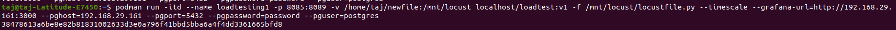

### 2.5 Run the load test with grafana and timescale-DB

Locust ui exposed to the http://localhost:8089
Start a new test with the number of users and spawn rate.

 You can see the user_count table as follows-

**Output:**

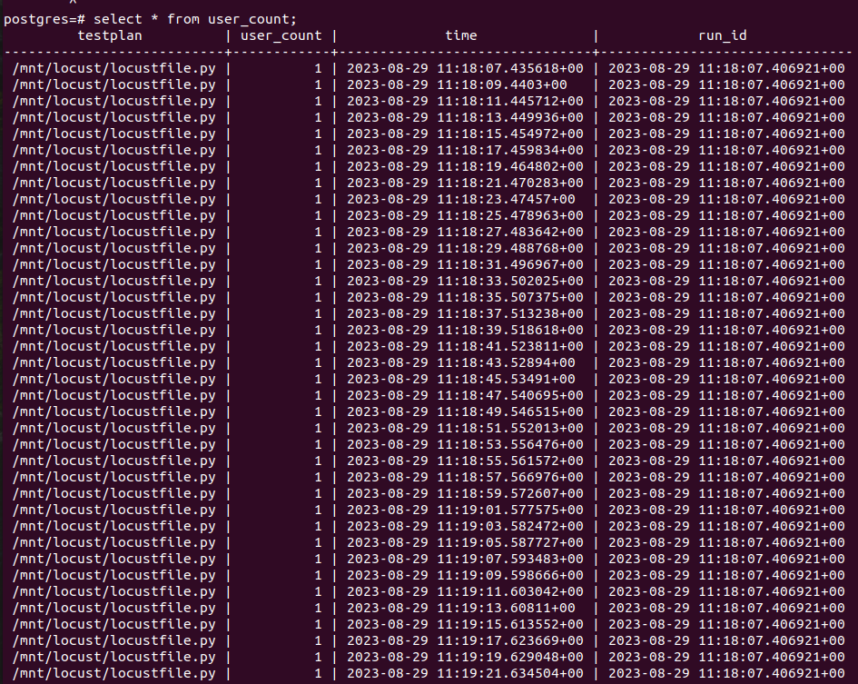

You can add panels in grafana to get the graphical view of the responses.

 **Reference link**

 * https://grafana.com/tutorials/grafana-fundamentals/

